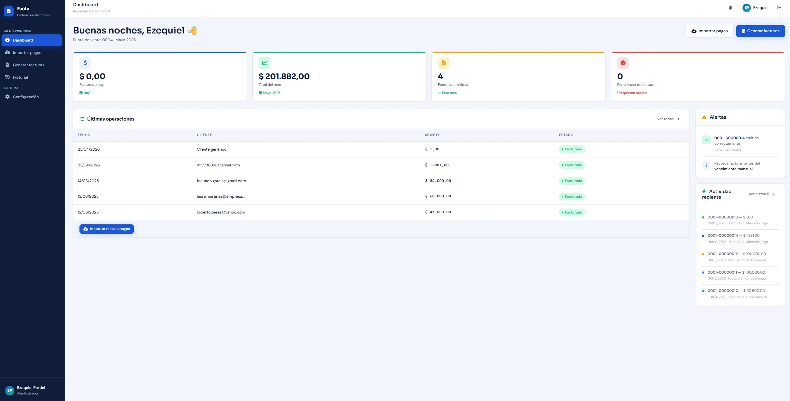
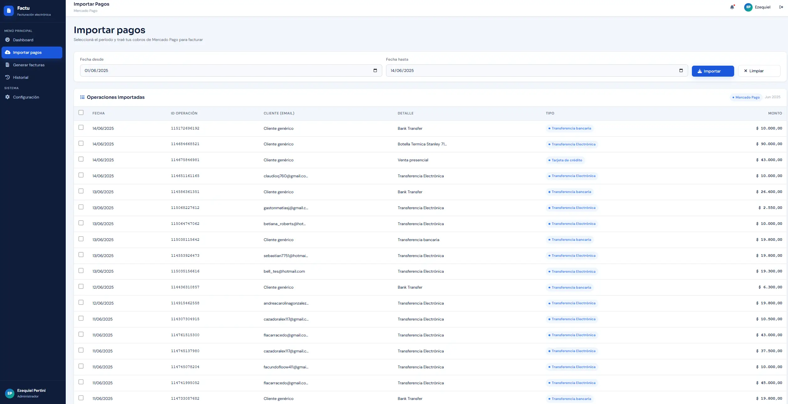
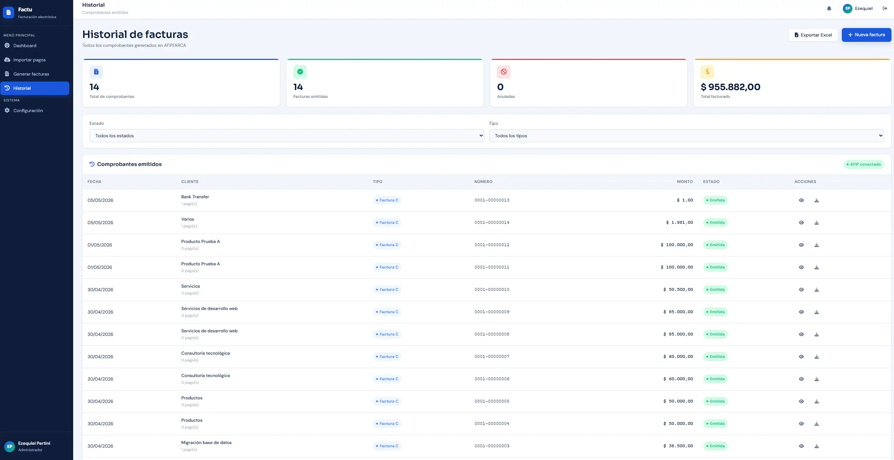

# Factu — Facturación Electrónica Simplificada

> Sistema web para autónomos y monotributistas argentinos que automatiza la conciliación de cobros y la emisión de comprobantes electrónicos.


---

## Descripción

**Factu** es un panel administrativo web que permite importar cobros desde Mercado Pago, clasificarlos y generar facturas electrónicas de forma simple y rápida. Está orientado a freelancers, profesionales independientes y pequeños comerciantes que necesitan cumplir con sus obligaciones fiscales sin complejidad técnica ni contable.

El sistema resuelve un problema real: la tarea manual y repetitiva de cruzar pagos recibidos con comprobantes emitidos en AFIP/ARCA. Factu automatiza ese flujo completo.

---

## Objetivo

Reducir el tiempo que un monotributista dedica mensualmente a conciliar cobros y emitir facturas, pasando de un proceso manual disperso en múltiples plataformas a un flujo unificado en un solo panel.

---

## Funcionalidades principales

### Importación de pagos
- Conexión con la API de Mercado Pago para importar cobros recibidos
- Filtrado por rango de fechas
- Detección automática del tipo de operación (transferencia, link de pago, Checkout Pro)
- Marcado visual de pagos ya facturados para evitar duplicados

### Generación de comprobantes
- Emisión de una factura individual por cada pago seleccionado
- Soporte para factura manual (cobros fuera de Mercado Pago: efectivo, transferencia bancaria, etc.)
- Selección de concepto, producto/servicio, tipo de comprobante y fechas
- Correlativo automático de numeración

### Historial de facturas
- Visualización de todos los comprobantes emitidos
- Métricas: total facturado, cantidad de facturas, anuladas
- Filtro por estado y tipo

### Dashboard
- Métricas en tiempo real: facturado hoy, total del mes, facturas emitidas, pagos pendientes
- Últimas operaciones importadas
- Actividad reciente de facturación
- Alertas dinámicas

### Configuración
- Datos fiscales del usuario: CUIT, razón social, punto de venta, condición fiscal, categoría de monotributo
- Gestión de productos/servicios con precios predefinidos
- Integración con token de Mercado Pago

### Módulo de contacto público
- Formulario público accesible desde la landing
- Rate limiting por IP para prevenir spam
- Persistencia en base de datos

---

## Tecnologías utilizadas

| Capa | Tecnología |
|---|---|
| Backend | PHP 8.2 (sin frameworks) |
| Base de datos | MySQL 8 con PDO |
| Frontend | HTML5, CSS3, JavaScript ES2022 (sin frameworks) |
| APIs externas | Mercado Pago API v1, ARCA/AFIP (en integración) |
| Servidor local | Apache (XAMPP) |
| Control de versiones | Git / GitHub |

---

## Arquitectura del proyecto

```
factu/
├── api/                        # Endpoints REST (JSON)
│   ├── login.php
│   ├── logout.php
│   ├── dashboard.php
│   ├── pagos.php
│   ├── mp_pagos.php            # Integración Mercado Pago
│   ├── facturas.php
│   ├── productos.php
│   ├── configuracion.php
│   └── contacto.php
│
├── includes/                   # Lógica compartida PHP
│   ├── auth.php                # Sesiones, login, logout
│   ├── db.php                  # Conexión PDO singleton
│   └── sidebar.php             # Componente de navegación
│
├── pages/                      # Páginas del panel administrativo
│   ├── dashboard.php
│   ├── importar.php
│   ├── facturar.php
│   ├── historial.php
│   ├── configuracion.php
│   └── contacto.php
│
├── assets/
│   ├── css/
│   │   └── styles.css          # Sistema de diseño unificado
│   └── js/
│       ├── app.js              # Funciones globales (toast, sidebar, login)
│       ├── dashboard.js
│       ├── pagos.js
│       ├── facturar.js
│       ├── historial.js
│       ├── productos.js
│       └── configuracion.js
│
├── img/                        # Imágenes y recursos estáticos
├── index.html                  # Landing page pública
└── README.md
```

**Patrón arquitectónico:** cada módulo tiene su propio archivo PHP en `/pages/` (presentación), su endpoint en `/api/` (lógica y datos) y su archivo JS en `/assets/js/` (interacción). No hay frameworks — la separación es explícita y manual.

---

## Capturas de pantalla

> *Screenshots en proceso de actualización*

| Dashboard | Importar pagos |
|---|---|
|  |  |

| Generar facturas | Historial |
|---|---|
|  |  |

---

## Instalación local

### Requisitos previos
- XAMPP (PHP 8.2 + Apache + MySQL)
- Cuenta de Mercado Pago con acceso a la API
- Git

### Pasos

```bash
# 1. Clonar el repositorio
git clone https://github.com/eze-pertini/factu-webapp
cd factu

# 2. Copiar la carpeta al directorio de XAMPP
# Windows: C:\xampp\htdocs\factu
# Linux/Mac: /opt/lampp/htdocs/factu
```

```sql
-- 3. Crear la base de datos en phpMyAdmin
CREATE DATABASE mini_facturante CHARACTER SET utf8mb4 COLLATE utf8mb4_unicode_ci;

-- 4. Ejecutar los archivos SQL en este orden:
--    usuarios.sql
--    pagos.sql
--    facturas.sql
--    productos.sql
--    configuracion.sql
--    contactos.sql
```

```bash
# 5. Copiar el archivo de configuración de ejemplo y completar con tus datos
cp config.example.php config.php
```

> Completá `config.php` con tus credenciales locales de MySQL. Este archivo está incluido en `.gitignore` y nunca se sube al repositorio.

```
// 6. Acceder al sistema
http://localhost/factu/index.html

// Credenciales de prueba
Email:    eze@example.com
Password: password123
```

---

## Configuración

### Mercado Pago
1. Crear una aplicación en [Mercado Pago Developers](https://www.mercadopago.com.ar/developers/panel/app)
2. Obtener el **Access Token de producción**
3. En el sistema: Configuración → Integración Mercado Pago → pegar el token → Guardar

### Datos fiscales
En Configuración → Datos fiscales completar:
- CUIT (formato `20-12345678-9`)
- Razón social
- Punto de venta (ej: `0001`)
- Condición fiscal y categoría de monotributo

---

## Seguridad y buenas prácticas implementadas

- **PDO con prepared statements** en todas las consultas — previene inyección SQL
- **`password_hash()` / `password_verify()`** para el manejo de contraseñas
- **Sesiones PHP** con `session_regenerate_id()` tras el login — previene session fixation
- **Validación y sanitización** en backend para todos los inputs, independientemente del frontend
- **Autenticación verificada** en cada endpoint de la API antes de procesar datos
- **Rate limiting por IP** en el módulo de contacto público
- **El Access Token de Mercado Pago** se almacena en la DB y nunca se expone en respuestas GET
- **`htmlspecialchars()`** en todo output de datos dinámicos — previene XSS

---

## Estado del proyecto

| Módulo | Estado |
|---|---|
| Autenticación y sesiones | ✅ Completo |
| Dashboard con métricas reales | ✅ Completo |
| Importación desde Mercado Pago | ✅ Completo |
| Generación de facturas (desde MP) | ✅ Completo |
| Factura manual | ✅ Completo |
| Historial de comprobantes | ✅ Completo |
| Configuración fiscal en DB | ✅ Completo |
| Gestión de productos/servicios | ✅ Completo |
| Módulo de contacto público | ✅ Completo |
| Integración real ARCA/AFIP | ✅ Completo |
| Generación de PDF de comprobantes | 📋 Planificado |
| Módulo "Mi perfil" | 📋 Planificado |
| Deploy en producción | 📋 Planificado |

---

## Mejoras futuras

- **Integración ARCA/AFIP real** — emisión de CAE y generación de comprobantes válidos ante AFIP
- **PDF de facturas** — descarga del comprobante en formato PDF con diseño profesional
- **Módulo Mi Perfil** — cambio de nombre, email y contraseña desde la interfaz
- **Multi-usuario** — soporte para múltiples cuentas con roles y permisos
- **Exportación a Excel** — descarga del historial de facturas en `.xlsx`
- **Notificaciones automáticas** — alertas por vencimiento mensual de facturación
- **Deploy en VPS** — puesta en producción con dominio propio

---

## Autor

**Ezequiel Pertini**
Desarrollador Full Stack — Buenos Aires, Argentina

[](https://linkedin.com/in/ezequiel-pertini)
[](https://github.com/eze-pertini)

---

*Proyecto desarrollado como herramienta personal de uso real, evolucionando hacia un producto SaaS para el mercado argentino.*
